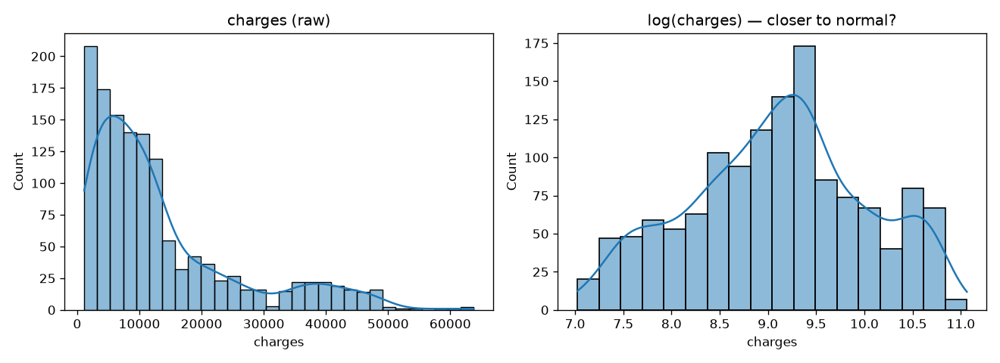
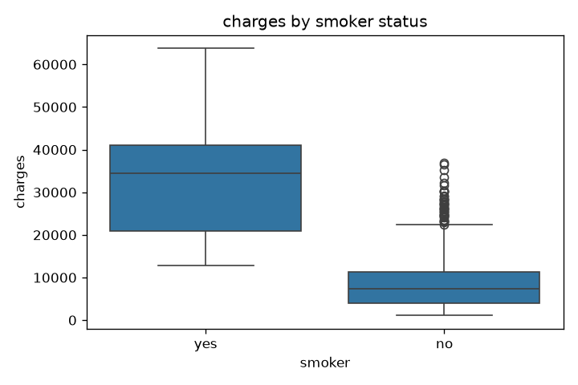
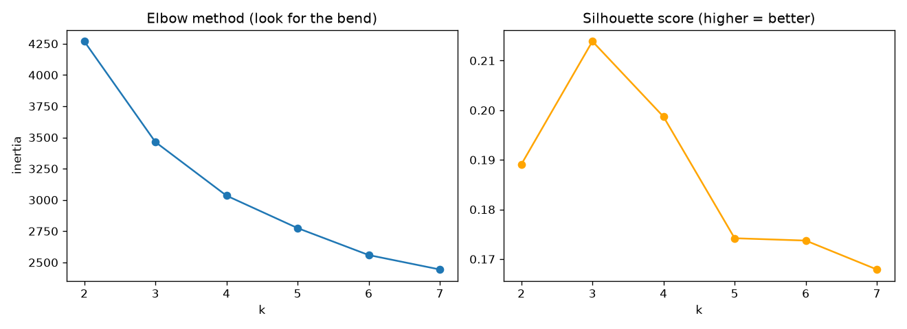

# Healthcare Cost Analytics

One dataset, four classical machine learning techniques, deployed behind a real API.
Built to actually learn **regression**, **classification**, **clustering**, and
**anomaly detection** properly — not just to have a project to list.

| Technique | Question it answers |
| --- | --- |
| Regression | Given a patient's profile, what will their medical cost be? |
| Classification | Is this patient high-cost-risk (yes/no)? |
| Clustering | Are there natural patient segments, with no labels given? |
| Anomaly detection | Which claims cost far more than their profile predicts? |

---

## Concepts covered

A glossary of every technique and term used in this project, in plain language.

**Supervised vs. unsupervised learning** — supervised learning trains on data
that already has the "right answer" attached (e.g. we know each patient's
actual `charges`); the model learns to predict that answer for new data.
Unsupervised learning has no right answer to learn from — it finds structure
(like groupings) in the data on its own. Regression and classification below
are supervised; clustering is unsupervised.

**Regression** — predicting a *continuous number* (here, medical cost in
dollars). "How much" rather than "which category."

**Classification** — predicting a *category* (here, high-cost-risk: yes/no).
"Which bucket" rather than "how much."

**Clustering** — grouping data points by similarity with no predefined labels.
The algorithm decides what the groups are; we interpret what they mean afterward.

**Anomaly detection** — flagging data points that don't fit the normal pattern.
Can be built from a regression model's errors (residual-based) or from a model
designed specifically for it (Isolation Forest).

**Train/test split** — splitting data so the model trains on one portion and
is evaluated on a portion it never saw during training. Without this, a model
could simply memorize the training data and look perfect while being useless
on new patients. **Stratified** split (used in classification) keeps the same
class proportions (e.g. 75% low-cost / 25% high-cost) in both the train and
test sets.

**Overfitting** — when a model learns the training data too specifically
(including its noise) instead of the general pattern, so it performs well on
training data but poorly on new data. Comparing a simple model (Linear
Regression) against a more flexible one (Random Forest) on the *same* held-out
test set is one way to catch this.

**One-Hot Encoding** — converting a text category (e.g. `region`:
northeast/northwest/southeast/southwest) into separate 0/1 columns, since
models need numbers, not text.

**Feature scaling (StandardScaler)** — rescaling numeric features (age, bmi)
to a common scale (mean 0, standard deviation 1). Needed for distance-based
methods like K-Means, where a feature with naturally larger numbers (age:
18–64) would otherwise dominate a feature with smaller numbers unfairly.

**MAE / RMSE / R²** — three ways to score a regression model. **MAE** (Mean
Absolute Error) is the average dollar amount the prediction was off by — easy
to interpret directly. **RMSE** (Root Mean Squared Error) is similar but
penalizes large misses more heavily. **R²** is the fraction of the target's
variance the model explains (0 = no better than guessing the average, 1 =
perfect).

**Precision / Recall / F1** — three ways to score a classifier, especially
important when classes are imbalanced (see below). **Precision**: of everyone
the model flagged, what fraction actually belonged to that class? **Recall**:
of everyone who actually belonged to that class, what fraction did the model
catch? **F1**: the balance of the two, useful when you care about both.

**ROC-AUC** — measures how well a model *ranks* positive cases above negative
ones, across every possible decision threshold (not just the default 0.5).
0.5 = random guessing, 1.0 = perfect ranking. Can disagree with F1, since F1
is tied to one specific threshold.

**Confusion matrix** — a 2×2 table of actual vs. predicted class (true
positives, false positives, true negatives, false negatives) that every other
classification metric above is calculated from.

**Class imbalance** — when one category is much rarer than another (here,
25% high-cost vs. 75% low-cost). Dangerous because a model that always
predicts the majority class can still score high on plain accuracy while
being useless — this is why precision/recall/F1 matter more than accuracy alone.

**K-Means** — a clustering algorithm that groups points into *k* clusters by
repeatedly assigning each point to its nearest cluster center, then recomputing
the centers, until it stabilizes. *k* has to be chosen in advance.

**Elbow method / Silhouette score** — two ways to choose *k* for K-Means when
there's no obviously "correct" number of clusters. The elbow method looks for
where adding more clusters stops meaningfully reducing error. The silhouette
score (used here) directly measures how distinct and well-separated the
clusters are, from -1 (bad) to 1 (perfect).

**Isolation Forest** — an algorithm built specifically for anomaly detection.
It randomly splits the data repeatedly; outliers get isolated in fewer splits
than normal points because they sit further from everything else.

**Ensemble learning (Random Forest)** — combining many individual models
(here, many decision trees, each trained on a random subset of the data) and
averaging their predictions. Usually more accurate and more resistant to
overfitting than any single model in the ensemble.

**Pipeline** (scikit-learn) — chaining preprocessing steps (like one-hot
encoding) and a model together into one object, so the same transformations
are applied consistently to both training data and any new data at prediction
time.

---

## Dataset

[`data/insurance.csv`](data/insurance.csv) — the public **Medical Cost Personal
Datasets** (1,338 rows: age, sex, bmi, children, smoker, region, charges).
Originally compiled for the book *Machine Learning with R* (Brett Lantz); this
copy is from
[stedy/Machine-Learning-with-R-datasets](https://github.com/stedy/Machine-Learning-with-R-datasets).

This is a well-known public dataset used here for learning — **not** real
claims or pricing data from any employer or client.

---

## 1. Exploratory Data Analysis

Before training anything, look at the data. The single biggest finding:
**smoking status dominates cost far more than age or BMI.**

| | Non-smoker | Smoker |
| --- | --- | --- |
| Average charges | $8,434 | $32,050 |

That's a ~4x difference from one binary variable — while age and BMI
individually only correlate weakly with cost (0.30 and 0.20).



The raw `charges` distribution is strongly right-skewed (skew = 1.52) — most
patients cost little, a few cost a lot. Log-transforming (right plot) pulls it
closer to normal, which is why we compare a simple linear model against a
tree-based model below rather than assuming linearity holds.



**Script:** [`01_eda.py`](01_eda.py)

---

## 2. Regression — predicting cost

Two models, compared on purpose — a Random Forest that can't beat a plain
Linear Regression by much isn't earning its extra complexity:

| Model | MAE (avg $ error) | RMSE | R² |
| --- | --- | --- | --- |
| Linear Regression | $4,181 | $5,796 | 0.784 |
| **Random Forest** | **$2,524** | **$4,440** | **0.873** |

Random Forest wins clearly. The cost relationship isn't purely linear — smoking
likely *interacts* with age and BMI (a smoker's cost rises faster with age
than a non-smoker's) rather than adding independently, and tree-based models
capture that kind of interaction naturally.

**Script:** [`02_regression.py`](02_regression.py)

---

## 3. Classification — flagging high-cost-risk patients

The dataset has no "risk" label, so one is derived: the top 25% of charges
(> $16,640) is labeled "high-cost." This mirrors how a real claims system
would flag cases for review.

| Model | Accuracy | Precision | Recall | F1 | ROC-AUC |
| --- | --- | --- | --- | --- | --- |
| Logistic Regression | 0.914 | 0.940 | 0.701 | 0.803 | **0.864** |
| **Random Forest** | **0.922** | **0.979** | 0.701 | **0.817** | 0.837 |

Both models catch ~70% of actual high-cost patients while rarely
false-flagging (precision up to 0.98). Note the split decision: Random Forest
wins on F1, but Logistic Regression has the *higher* ROC-AUC. F1 is measured
at a single probability threshold (0.5); ROC-AUC measures ranking quality
across every possible threshold. In a real system you'd tune the threshold
rather than pick a model on F1 alone.

**Script:** [`03_classification.py`](03_classification.py)

---

## 4. Clustering — patient segments, unsupervised

Regression and classification are *supervised* — there's a known right answer
to train against. Clustering is *unsupervised*: K-Means looks at patient
features alone and finds groupings, with no labels at all.



k=3 scored best by silhouette (0.214) — but that's a **low** silhouette score
(above ~0.5 is considered strong structure). Reported honestly rather than
oversold: what K-Means found is a real but *soft* age-based grouping, not
sharply separated patient types.

| Cluster | Count | Avg age | Avg BMI | % smoker | Avg charges |
| --- | --- | --- | --- | --- | --- |
| 0 | 396 | 40.7 | 31.1 | 22% | $14,796 |
| 1 | 489 | 25.5 | 29.6 | 21% | $9,454 |
| 2 | 453 | 52.7 | 31.4 | 18% | $16,057 |

**Script:** [`04_clustering.py`](04_clustering.py)

---

## 5. Anomaly detection — claims that don't fit their profile

This maps directly onto real-world "claims/pricing anomaly detection" work.
Two independent methods:

- **Residual-based**: compare actual cost to the regression model's predicted
  cost; flag anything costing >2x expected.
- **Isolation Forest**: a model built specifically for outlier detection,
  applied to the raw numeric features.

Each flagged ~5% of patients. The two methods *appeared* to agree 90.6% of
the time — but that number is misleading. Of everyone flagged by **either**
method, only **1 of 127** was flagged by **both** (~0.8% true overlap). The
90.6% figure is inflated because both methods correctly agree on the ~95% of
*normal* patients — the same failure mode as trusting plain accuracy under
class imbalance, just showing up in a different metric.

**Script:** [`05_anomaly_detection.py`](05_anomaly_detection.py)

---

## 6. Deployment — a real API, not just a notebook

All four trained models are served behind FastAPI:

| Endpoint | Technique |
| --- | --- |
| `POST /predict/cost` | Regression |
| `POST /predict/risk` | Classification |
| `POST /segment` | Clustering |
| `POST /predict/anomaly` | Anomaly detection |

```bash
curl -X POST http://127.0.0.1:8000/predict/cost \
  -H "Content-Type: application/json" \
  -d '{"age":45,"sex":"male","bmi":32.5,"children":2,"smoker":"yes","region":"southeast"}'
# {"predicted_charges": 41867.84}
```

**Script:** [`06_api.py`](06_api.py)

---

## Running it yourself

```bash
python -m venv .venv
.venv/Scripts/activate        # or source .venv/bin/activate on Mac/Linux
pip install pandas numpy scikit-learn matplotlib seaborn joblib fastapi uvicorn

python 01_eda.py
python 02_regression.py
python 03_classification.py
python 04_clustering.py
python 05_anomaly_detection.py    # needs 02_regression.py's saved model
uvicorn 06_api:app --reload       # needs all of the above run at least once
```

Then open `http://127.0.0.1:8000/docs` for interactive Swagger docs.

## Project structure

```
01-healthcare-cost-analytics/
├── data/insurance.csv          # public dataset
├── 01_eda.py                   # exploratory analysis
├── 02_regression.py            # predict cost
├── 03_classification.py        # flag high-cost-risk
├── 04_clustering.py            # unsupervised patient segments
├── 05_anomaly_detection.py     # flag unusual claims
├── 06_api.py                   # FastAPI serving all four models
├── models/                     # trained models (.joblib)
└── outputs/                    # saved plots
```

## What I'd improve next

- Try log-transforming `charges` before fitting Linear Regression, given the
  right-skew found in EDA — likely closes some of the gap with Random Forest.
- The anomaly-detection comparison would be stronger with a labeled
  ground-truth anomaly set (this dataset has none) to actually score precision/recall
  instead of just comparing two unsupervised methods to each other.
- Add features Isolation Forest doesn't currently see (smoker, region) — right
  now it only looks at age/bmi/children/charges.
